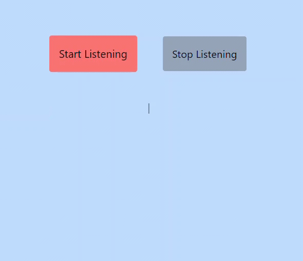

gCreating a detailed README.md file for your TypeScript, Tailwind CSS, Vite, and SWC-based

# Voice Transcription App



A simple web app that transcribes voice input using the Speech Recognition API supported in browsers. This app provides users with "Start Recording" and "Stop Recording" buttons to transcribe spoken words into text.

## Table of Contents

- [Demo](#demo)
- [Features](#features)
- [Prerequisites](#prerequisites)
- [Installation](#installation)
- [Usage](#usage)
- [Contributing](#contributing)
- [License](#license)

## Demo

You can check out a live demo of this app [here](#), or follow the instructions below to run it locally.

## Features

- **Voice Transcription:** Record your voice and get the spoken words transcribed into text.
- **Modern Browser Support:** The app checks if the user's browser supports the Speech Recognition API before allowing voice transcription.

## Prerequisites

Before you begin, ensure you have met the following requirements:

- A modern web browser (e.g., Chrome, Firefox, Edge) with support for the Speech Recognition API.

## Installation

1. Clone the repository:

   ```bash
   git clone https://github.com/hamid-Ft/voice-transcribe.git
   ```

2. Change to the project directory:

   ```bash
   cd voice-transcribe
   ```

3. Install the project dependencies using [npm](https://www.npmjs.com/):

   ```bash
   npm install
   ```

## Usage

1. Start the development server:

   ```bash
   npm run dev
   ```

2. Open your browser and navigate to [http://localhost:5173](http://localhost:5173)
3. Click the "Start Recording" button to begin recording your voice.
4. Speak into your microphone, and the app will transcribe your speech in real-time.
5. Click the "Stop Recording" button to end the transcription.
6. View the transcribed text on the screen.

## Contributing

Contributions are welcome! To contribute to this project, follow these steps:

1. Fork the project.
2. Create a new branch for your feature or bug fix:

   ```bash
   git checkout -b feature/your-feature
   ```

3. Make your changes and commit them:

   ```bash
   git commit -m 'Add your feature'
   ```

4. Push your changes to your fork:

   ```bash
   git push origin feature/your-feature
   ```

5. Create a pull request in this repository.

Please ensure your code follows the project's coding standards and includes relevant tests.

## Author

- [@hamid-Ft](https://www.github.com/hamid-Ft)

For additional information or questions, feel free to contact me:

- Email: hamidfattahi.a@gmail.com

Enjoy using your Voice Transcription App!

## License

This project is licensed under the MIT License. See the [LICENSE](LICENSE) file for details.

[](https://choosealicense.com/licenses/mit/)
